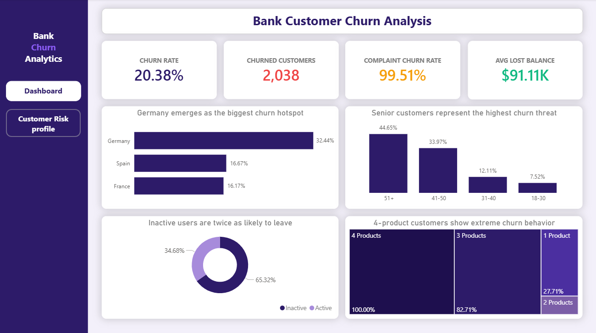
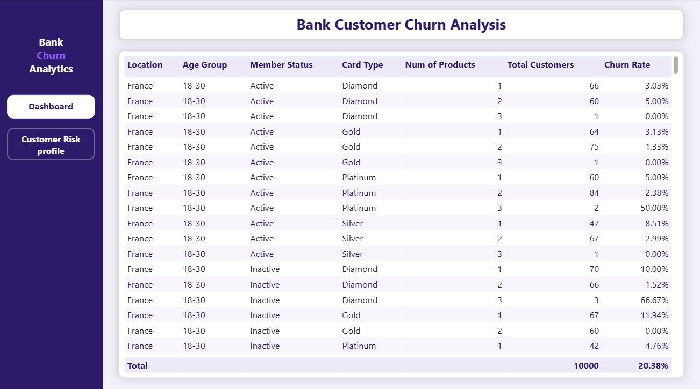

# 🏦 Bank Customer Churn Analysis

## 📌 Problem Statement
A European bank is losing 20% of its customers every year. This project analyzes 10,000 customer records to identify who is churning, why they are leaving, and what the bank can do about it.

## 🛠 Tools Used
| Tool | Purpose |
|---|---|
| Python (Pandas) | Data Cleaning |
| MySQL | Data Analysis |
| Power BI | Dashboard & Visualization |

## 📂 Dataset
- **Source:** Kaggle — Bank Customer Churn Dataset
- **Link:** kaggle.com/datasets/radheshyamkollipara/bank-customer-churn
- **Rows:** 10,000 customers
- **Columns:** 18 features

## 🔄 Project Workflow
Raw Data → Excel (Explore) → Python (Clean) → MySQL (Analyze) → Power BI (Visualize) → GitHub (Publish)

## 🔑 Key Insights
- **20.38%** overall churn rate — 1 in 5 customers leaving
- **99.51%** of customers who filed complaints churned
- **Germany** has the highest churn rate at 32.44%
- Customers aged **51+** churn at 44.65%
- **Inactive members** churn 2x more than active ones
- Customers with **4 products** show 100% churn rate
- Churned customers had higher average balance of **$91K** — the bank is losing its best customers

## 📊 Dashboard Preview

### Main Dashboard

### Customer Risk Profile (Interactive View)

> The Customer Risk Profile is an interactive bookmark view accessible via navigation button on the dashboard.

## 📁 Files in Repository
| File | Description |
|---|---|
| bank_churn_cleaned.ipynb | Python data cleaning script |
| bank_churn_queries.sql | MySQL analysis queries |
| Customer-Churn-Records.csv | Original Kaggle dataset |
| dashboard_screenshot1.png | Main dashboard view |
| dashboard_screenshot2.png | Customer Risk Profile view |

## 💡 Recommendations
1. Fix complaint resolution process immediately
2. Launch retention campaign targeting German customers
3. Re-engage inactive members before they churn
4. Stop pushing 3-4 products to same customer
